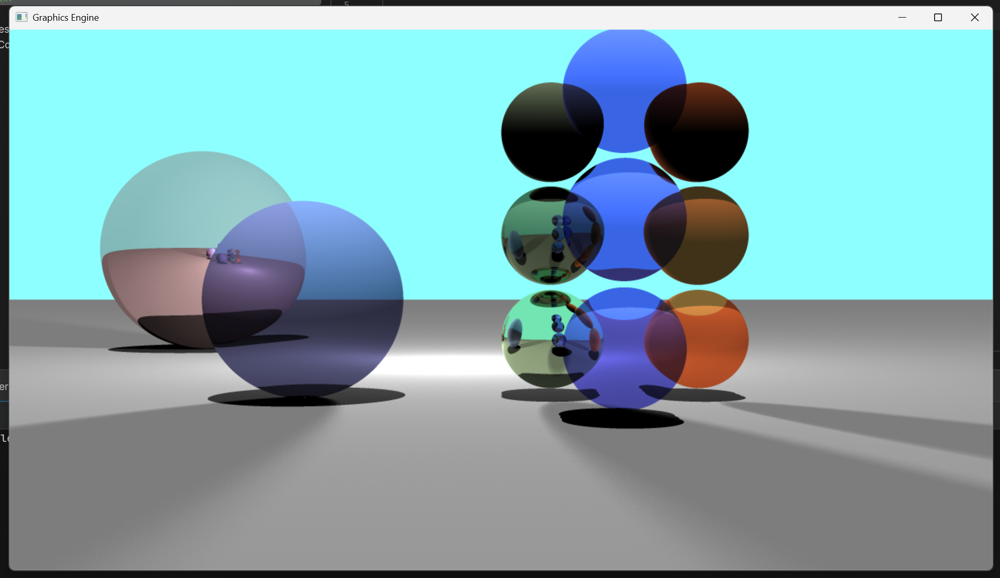

# C Ray Tracer

A Software Ray Tracer written in C

### Supported Features:

- C-Style Polymorphic Scene List (Tagged Unions)
- Ray-Sphere, Ray-Plane intersection
- Diffuse, Reflective, & Refractive materials
- Point Lights
- Directional Lights
- Area Lights
- Direct Illumination
- Incremental Chunk Rendering
- Windows GDI windowing

### Main Challenges

- Ray-Object intersection derivations
- Polymorphic scene composition in C
- Windows GDI verbosity

### Usage Guide:

This project is for learning, so scene generation is entire procedural & hard-coded.

To use this code yourself, clone the repository, and import the CMake project in your favorite C IDE.

See `main.c` for the code that generated these scenes below:

### Showcase Render:

